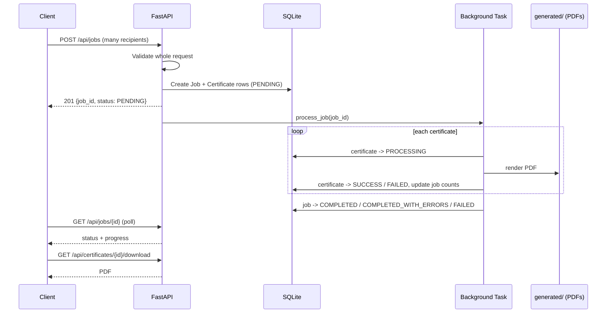

# 🎓 Bulk Certificate Generator

A backend API that accepts **one request containing many recipients** and generates a personalised PDF certificate for each of them, with job tracking, progress reporting and per-certificate failure isolation.

Built with **FastAPI**, **SQLAlchemy (SQLite)** and **ReportLab**.

---

## 📑 Table of Contents

- [Features](#-features)
- [Tech Stack](#-tech-stack)
- [Architecture](#-architecture)
- [Project Structure](#-project-structure)
- [Setup](#-setup)
- [Running the Application](#-running-the-application)
- [Quick Start](#-quick-start-try-it-in-2-minutes)
- [API Documentation](#-api-documentation)
- [Usage Walkthrough](#-usage-walkthrough)
- [Statuses](#-statuses)
- [Running Tests](#-running-tests)
- [Design Decisions](#-design-decisions)
- [Error Handling](#-error-handling)
- [Known Limitations](#-known-limitations)
- [Future Improvements](#-future-improvements)

---

## ✨ Features

- 📦 **Bulk generation**: one `POST` creates certificates for up to 1,000 recipients.
- ✅ **Strict validation**: empty names, invalid emails, missing fields and empty recipient lists are rejected with clear, field-level errors.
- 🧾 **Predefined template**: a single professional landscape A4 PDF template with the recipient name, course, date and a unique certificate ID.
- ⚙️ **Background processing**: the API responds immediately with a `job_id`; generation continues in the background.
- 📊 **Job tracking**: status, successful/failed counts and a progress percentage that updates live.
- 🛡️ **Failure isolation**: one failing certificate never stops the rest; every certificate has its own status and error message.
- ⬇️ **Retrieval**: list a job's certificates and download any generated PDF.
- 📝 **Structured logging** of the whole job lifecycle.
- 🧪 **Comprehensive test suite** covering every endpoint and failure path.

---

## 🧰 Tech Stack

| Layer | Technology |
|---|---|
| Language | Python 3.11 |
| Web framework | FastAPI + Uvicorn |
| Database | SQLite via SQLAlchemy 2.0 |
| Validation | Pydantic v2 (`EmailStr`) |
| PDF generation | ReportLab |
| Background work | FastAPI `BackgroundTasks` |
| Testing | Pytest + FastAPI `TestClient` (HTTPX) |

---

## 🏗️ Architecture



**Layers**

- `routers/`: HTTP layer (request/response handling, status codes)
- `schemas/`: Pydantic request/response models and validation rules
- `services/`: business logic (`certificate_generator`, `job_processor`)
- `models/`: SQLAlchemy tables (`jobs`, `certificates`; one job has many certificates)

---

## 📂 Project Structure

```
bulk-certificate-generator/
├── app/
│   ├── main.py                    # App factory, routers, error handler, logging
│   ├── config.py                  # Settings (env-driven)
│   ├── database.py                # Engine, session, init_db
│   ├── logging_config.py
│   ├── models/
│   │   ├── job.py                 # Job + JobStatus
│   │   └── certificate.py         # Certificate + CertificateStatus
│   ├── schemas/
│   │   ├── job.py                 # Request/response models + validation
│   │   └── certificate.py
│   ├── routers/
│   │   ├── jobs.py                # POST/GET /api/jobs...
│   │   └── certificates.py        # GET /api/certificates/{id}/download
│   ├── services/
│   │   ├── certificate_generator.py   # PDF template + rendering
│   │   └── job_processor.py           # Background bulk processing
│   └── utils/
│       └── validators.py          # Friendly 422 error formatting
├── tests/                         # Pytest suite
├── generated/                     # Output PDFs (git-ignored)
├── requirements.txt
├── pytest.ini
├── .env.example
└── README.md
```

---

## 🛠️ Setup

**Prerequisites:** Python 3.11+ and Git.

```bash
git clone <YOUR_REPO_URL>
cd bulk-certificate-generator

python -m venv .venv
source .venv/bin/activate          # Windows: .venv\Scripts\activate

pip install -r requirements.txt

cp .env.example .env               # Windows: copy .env.example .env
```

**Configuration** (`.env`, all optional, defaults shown):

| Variable | Default | Description |
|---|---|---|
| `LOG_LEVEL` | `INFO` | Logging verbosity |
| `DATABASE_URL` | `sqlite:///./certificates.db` | SQLAlchemy database URL |
| `GENERATED_DIR` | `generated` | Where PDFs are written |

> 🔒 `.env`, the database file and generated PDFs are git-ignored. No secrets are required to run this project.

---

## 🚀 Running the Application

```bash
uvicorn app.main:app --reload --port 8000
```

Database tables are created automatically on startup.

| URL | Purpose |
|---|---|
| http://localhost:8000/docs | 📘 Swagger UI (interactive) |
| http://localhost:8000/redoc | 📗 ReDoc |
| http://localhost:8000/health | ❤️ Health check |

---

## ⚡ Quick Start (try it in 2 minutes)

The easiest way to try the API is through Swagger UI:

1. Start the server and open **http://localhost:8000/docs**.
2. **`POST /api/jobs`** → *Try it out* → edit the pre-filled example → *Execute*. Copy the returned `job_id`.
3. **`GET /api/jobs/{job_id}`** → paste the id → *Execute*. Wait for `"status": "COMPLETED"` and `"progress": 100`.
4. **`GET /api/jobs/{job_id}/certificates`** → copy a certificate `id`.
5. **`GET /api/certificates/{certificate_id}/download`** → *Execute* → *Download file* to open the PDF.

Generated PDFs are also saved on disk under `generated/job_<job_id>/`.

> 💡 **Windows tip:** inline JSON in `curl` is awkward in `cmd`. Save the request body to `request.json` and use `curl -X POST http://localhost:8000/api/jobs -H "Content-Type: application/json" -d @request.json`.

---

## 📘 API Documentation

| Method | Endpoint | Description | Success | Errors |
|---|---|---|---|---|
| `POST` | `/api/jobs` | Submit a bulk generation request | `201` | `422` |
| `GET` | `/api/jobs/{job_id}` | Job status and progress | `200` | `404` |
| `GET` | `/api/jobs/{job_id}/certificates` | Per-certificate results | `200` | `404` |
| `GET` | `/api/certificates/{certificate_id}/download` | Download a PDF | `200` | `404`, `409` |
| `GET` | `/health` | Health check | `200` | none |

Full interactive documentation (with try-it-out) is available in Swagger at `/docs`.

---

## 🧭 Usage Walkthrough

### 1️⃣ Submit a certificate generation request

```bash
curl -X POST http://localhost:8000/api/jobs \
  -H "Content-Type: application/json" \
  -d '{
    "title": "Certificate of Completion",
    "course": "AI/ML Workshop",
    "date": "2026-10-07",
    "recipients": [
      {"name": "Anshika Agrawal", "email": "anshika@example.com"},
      {"name": "Rahul Sharma", "email": "rahul@example.com"}
    ]
  }'
```

**Response** `201 Created`

```json
{
  "job_id": "9875c0d956a54fb984eb4061be7e39e5",
  "status": "PENDING"
}
```

### 2️⃣ Check progress

```bash
curl http://localhost:8000/api/jobs/9875c0d956a54fb984eb4061be7e39e5
```

```json
{
  "job_id": "9875c0d956a54fb984eb4061be7e39e5",
  "status": "COMPLETED",
  "total": 2,
  "successful": 2,
  "failed": 0,
  "progress": 100,
  "created_at": "2026-10-07T08:40:50.650009",
  "completed_at": "2026-10-07T08:40:50.694980"
}
```

### 3️⃣ List the job's certificates

```bash
curl http://localhost:8000/api/jobs/9875c0d956a54fb984eb4061be7e39e5/certificates
```

```json
{
  "job_id": "9875c0d956a54fb984eb4061be7e39e5",
  "certificates": [
    {
      "id": "d77e22983db049b7b903692468292b0e",
      "recipient": "Anshika Agrawal",
      "email": "anshika@example.com",
      "status": "SUCCESS",
      "error": null
    },
    {
      "id": "673a534427024e0e97bb9c64bcb31b2c",
      "recipient": "Rahul Sharma",
      "email": "rahul@example.com",
      "status": "SUCCESS",
      "error": null
    }
  ]
}
```

A failed certificate appears with `"status": "FAILED"` and a populated `"error"`.

### 4️⃣ Download a certificate

```bash
curl -o certificate.pdf \
  http://localhost:8000/api/certificates/d77e22983db049b7b903692468292b0e/download
```

PDFs are also stored on disk at `generated/job_<job_id>/certificate_<certificate_id>.pdf`.

### ❌ Validation error example

```json
{
  "detail": "Validation failed",
  "errors": [
    {"field": "recipients.0.name",  "message": "String should have at least 1 character"},
    {"field": "recipients.0.email", "message": "value is not a valid email address: An email address must have an @-sign."}
  ]
}
```

---

## 🚦 Statuses

**Job**

| Status | Meaning |
|---|---|
| `PENDING` | Created, waiting to be processed |
| `PROCESSING` | Certificates are being generated |
| `COMPLETED` | Every certificate succeeded |
| `COMPLETED_WITH_ERRORS` | Some succeeded, some failed |
| `FAILED` | Nothing could be generated (all failed) or an unexpected processing error aborted the job |

**Certificate:** `PENDING` → `PROCESSING` → `SUCCESS` or `FAILED`

**Progress** = `(successful + failed) / total × 100`

---

## 🧪 Running Tests

```bash
pytest -v
```

What the tests cover:

- ✅ Job creation (201, DB records, 100-recipient bulk request)
- ✅ Input validation (schema level and API level, error format)
- ✅ PDF generation (file location, recipient data inside the PDF, long names)
- ✅ Job status and progress (including live `PROCESSING` state)
- ✅ Individual certificate failure (others still succeed, error recorded)
- ✅ Retrieval and download (headers, content, 404 and 409 cases)
- ✅ Certificate ordering (matches submission order, even with identical timestamps)
- ✅ Invalid job IDs and certificate IDs
- ✅ End-to-end flow: submit → track → list → download

Tests use an **in-memory SQLite database** and a **temporary output directory**, so they never touch your real data or the `generated/` folder. FastAPI's `TestClient` runs background tasks before returning, so tests can assert the final job state deterministically.

---

## 🧠 Design Decisions

### ⚙️ Background processing vs. synchronous

**Choice: background processing with FastAPI `BackgroundTasks`.**

A single request can contain up to 1,000 recipients. Generating that many PDFs synchronously would hold the HTTP connection open for a long time, risk client/proxy timeouts, and give no progress information. Instead, `POST /api/jobs` validates, persists the job and returns a `job_id` immediately; the client polls the status endpoint.

I deliberately did **not** use Celery + Redis. For this scope it would add a broker, worker processes and deployment complexity without changing the API contract. The trade-offs of `BackgroundTasks` are listed in [Known Limitations](#-known-limitations), and the processing logic lives in a standalone function (`process_job`), so moving it to a real task queue later is a small change.

### ✅ All-or-nothing request validation

If any recipient in a request is invalid, the **entire request is rejected** with a `422` that names the exact field (e.g. `recipients.1.email`) and nothing is created. This keeps the API predictable (an accepted job means every recipient was valid) and lets the client fix and resubmit one payload. Failure *isolation* applies to problems that occur during generation, after the job is accepted.

### 🗄️ Data model

`jobs` (1) → (many) `certificates`. Job metadata (`title`, `course`, `issue_date`) is stored on the job so the background task can render certificates without the original request. IDs are UUID4 hex strings, which are non-guessable and safe to expose in URLs. Each certificate stores its `position` in the original request, so listing and processing order is deterministic and never depends on timestamp resolution.

### 📈 Live progress

The processor commits after **every** certificate and updates the job's success/failure counters, so `GET /api/jobs/{id}` reflects real progress while the job runs.

### 📄 Certificate rendering

ReportLab draws one fixed template (double border, title, name, course, date, certificate ID). Font size shrinks automatically for long names or titles. Files are written to `generated/job_<job_id>/certificate_<certificate_id>.pdf`, and the database stores the path.

### ⬇️ Download semantics

`404` for an unknown certificate or a missing file, `409 Conflict` when the certificate exists but is not downloadable (pending, processing or failed), so clients can tell "wrong ID" apart from "not ready".

### 🎯 Job `FAILED` definition

`COMPLETED_WITH_ERRORS` means partial success. `FAILED` is reserved for when no certificate could be generated or the processor itself hit an unexpected error.

---

## 🛡️ Error Handling

- **Per-certificate isolation:** each certificate is generated inside its own `try/except`. On failure only that certificate is marked `FAILED` with its error message, and processing continues.
- **Job-level safety net:** an unexpected error (e.g. database failure) is caught, remaining certificates are marked `FAILED` ("Job aborted: ..."), counters are recomputed and the job is set to `FAILED` with a completion time, so a job is never left stuck in `PROCESSING`.
- **No partial files:** if rendering fails midway, the half-written PDF is deleted.
- **Clear client errors:** `422` (field-level validation, including malformed JSON), `404` (unknown job/certificate) and `409` (certificate not available).
- **Logging:** the lifecycle is logged, for example:

```
INFO  [app.routers.jobs] Job <id> created with 3 recipients
INFO  [app.services.job_processor] Generating certificate for Anshika
INFO  [app.services.job_processor] Certificate generated successfully for Anshika
ERROR [app.services.job_processor] Certificate generation failed for Rahul: <reason>
INFO  [app.services.job_processor] Job <id> completed: COMPLETED_WITH_ERRORS (2 ok, 1 failed)
```

---

## ⚠️ Known Limitations

- 🔁 **Background tasks are in-process.** If the server restarts mid-job, that job stays in `PROCESSING` and is not resumed.
- 🗃️ **SQLite** is ideal for this assignment but is a single-writer database; use PostgreSQL for real concurrent load.
- 🔤 **Latin-only font.** The built-in Helvetica font does not render non-Latin scripts (e.g. Devanagari) correctly.
- 📉 Certificates are generated sequentially within a job (simple and predictable).
- 🔓 No authentication, since it was out of scope for this assignment.

---

## 🔮 Future Improvements

- 🧵 Task queue (Celery/RQ + Redis) for durable, resumable and horizontally scalable processing
- 🐘 PostgreSQL + Alembic migrations
- 🔤 Embedded Unicode font (e.g. Noto Sans) for international names
- 📦 Download all of a job's certificates as a single ZIP
- ✉️ Email each certificate to its recipient
- 🎨 Multiple selectable templates
- 🔐 API-key or OAuth authentication and per-user job ownership
- 📄 Pagination and status filtering on the certificate list
- 🔔 Webhook/callback when a job finishes
- 🐳 Docker packaging for one-command deployment